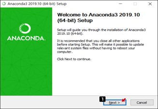
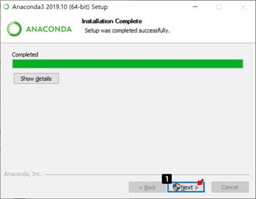
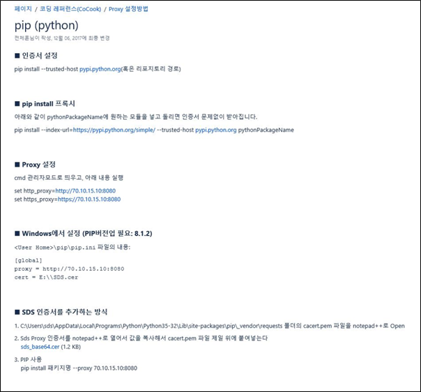

# DS Senior (lv.2)
문제 풀이

## 설치 및 환경설정
> 기본환경 : Windows10 1909 (64bit), Internet Explorer 11, Chrome, MS Office 2013

### 1. Python (v3.7.2) & Anaconda3 (v2019.10) 설치

- URL : https://repo.anaconda.com/archive/Anaconda3-2019.10-Windows-x86_64.exe
- 위 링크에서 설치파일 다운로드 후, 실행 ->  `[ Next ]` 클릭



- [ I Agree ] 클릭


 
- All User (requires admin privileges) 선택
- [ Next ] 클릭


 
- 설치경로 (C:\ProgramData\Anaconda3) 확인 후, [ Next ] 클릭
    


- Add Anaconda to the system PATH environment variable 선택
- Register Anaconda as the system Python 3.7 선택 후, [ Install ] 클릭


- [ Next ] 클릭




- [ Next ] 클릭
 
 


 
- Learn more about Anaconda Cloud 선택 해제
- Learn how get started with Anaconda 선택 해제 후, [ Finish ] 클릭


- Anaconda3 설치 완료
- 시작 버튼 클릭 후, Anaconda3 설치 확인 
(Anaconda Navigator, Anaconda prompt, Jupyter Notebook, Spyder)


#### pip 사용시 proxy 설정가이드 
http://devops.sdsdev.co.kr/confluence/pages/viewpage.action?pageId=97897668



 


### 2. Anaconda 패키지 추가 및 변경
- Anaconda Prompt 실행 (아래 명령어 입력 전에 pip proxy 가이드로 proxy설정필요)

#### (1) mlxtend 라이브러리 설치
- `pip install mlxtend==0.15.0` 입력


#### (2) numpy 라이브러리 설치
- `pip install numpy==1.18.5 --upgrade` 입력


#### (3) scipy 라이브러리 설치
- `pip install scipy==1.5.2 --upgrade` 입력


#### (4) sklearn 라이브러리 설치
- `pip install sklearn` 입력


#### (5) statsmodels 라이브러리 설치 
- `pip install statsmodels==0.11.1 --upgrade` 입력


#### (6) genism 라이브러리 설치 
- `pip install gensim==3.7.1 --upgrade` 입력


#### (7) xgboost 라이브러리 설치 
- `pip install xgboost==0.80 --upgrade` 입력


#### (8) nltk 라이브러리 설치 
- `pip install nltk==3.4.1 --upgrade` 입력


#### (9) konlpy 라이브러리 설치 
- `pip install konlpy==0.5.1 --upgrade` 입력


#### (10) 설치 확인
* 설치 패키지 정리
```
pip install mlxtend==0.15.0
pip install numpy==1.18.5 --upgrade
pip install scipy==1.5.2 --upgrade
pip install sklearn
pip install statsmodels==0.11.1 --upgrade
pip install gensim==3.7.1 --upgrade
pip install xgboost==0.80 --upgrade
pip install nltk==3.4.1 --upgrade
pip install konlpy==0.5.1 --upgrade
```


## 프로그램 설치 확인 및 테스트

### (1) Anaconda3(python3)
- Anaconda 설치 후 jupyter Notebook 실행
- New 버튼으로 python 파일 생성


- 아래의 코드 복사

```python
import pandas as pd
import numpy as np
print('hello world')
print('pandas test: ', pd.DataFrame([1,2,3]))
print('numpy test: ', np.sum([1,2,3]))
```

- 확인


2. 추가/변경 패키지 설치여부 확인
- Anaconda Prompt 실행


- 패키지 설치 여부 확인
```
pip list | findstr "mlxtend numpy scipy sklearn statsmodels genism xgboost nltk konlpy"
```
